# Cel przedmiotu
1. Określanie złożoności pamięciowej
2. Rozwój narzędzi matematycznych pozwalających porównywać algorytmy

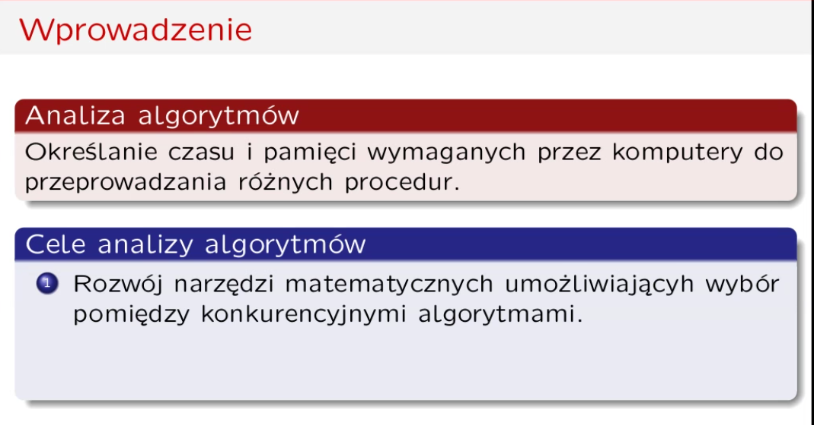

Przykład sortowanie 

# Czas wykonania

Operacje podstawowe są natywne w kodzie maszynowym.

Konkretne wartości nie mają znaczenia. Ważny jest typ funkcji. W tym przypadku liniowy.
Liczby inne niż n zmieniają się wraz z platformą. 

algortym wielomianowy — możenie macierzy 
istnieją algorytmy pośrednie np gorsze niż n^2, ale lepsze niż n^3
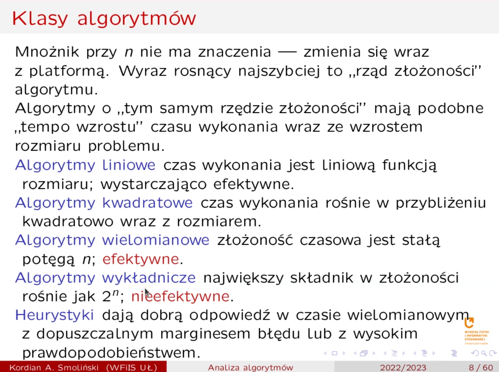
Heurystyki — monte carlo i las vegs

## Rząd złożoności
Przykład — sprawdzanie, czy lista zawiera element? 
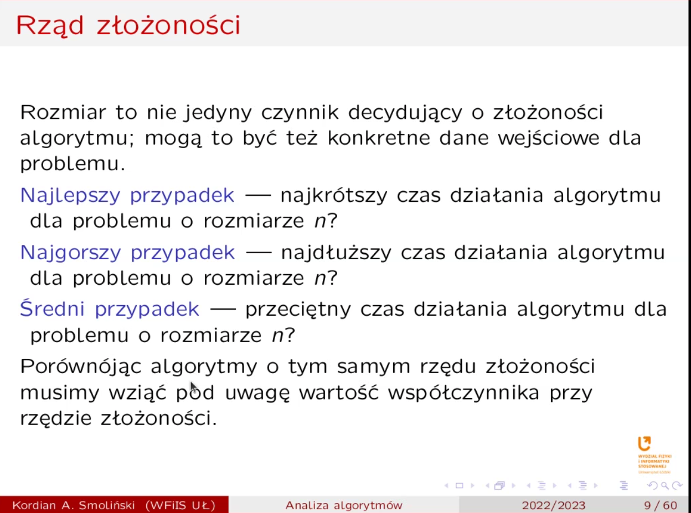

# Podstawy matematyczne 
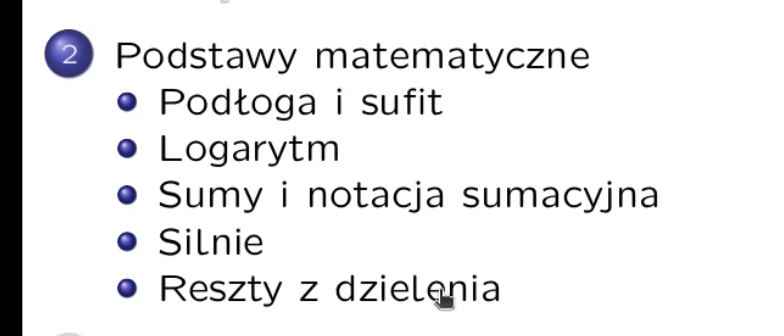

zawiera 0 !!!!!!!!!!oneone
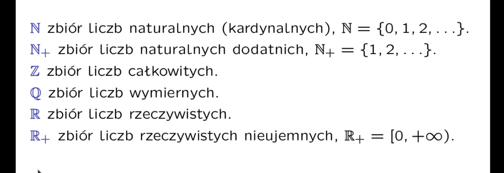

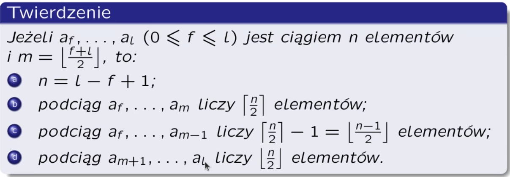
można powiedzieć że m dzieli ciąg na miniejeszą  i większą połowę ;) 

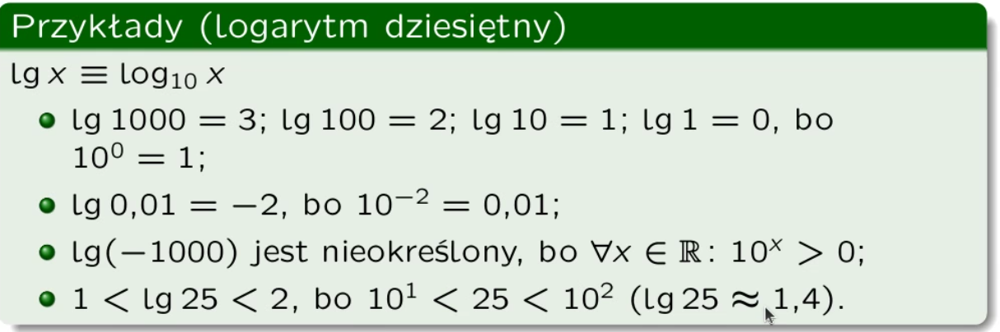
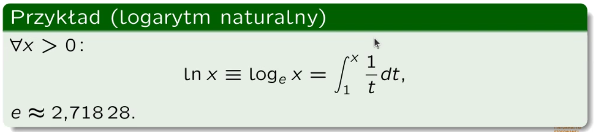
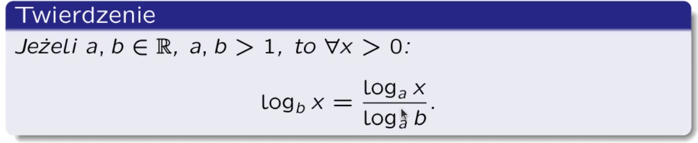

3.32 ~= 10/3 => wzrost długości cyfry o 10bit to wzrost o 3 cyfry dziesiętne

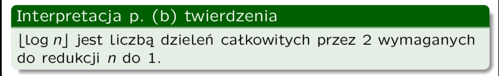
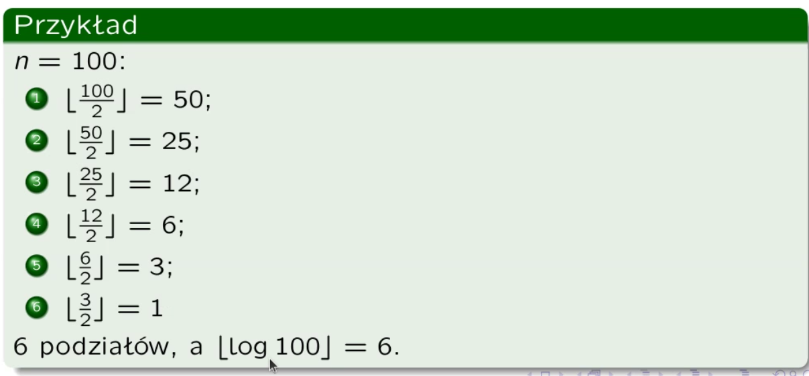
Ma to związek z quick sortme 

Funkcja logarytmiczna rośnie wolniej niż dowolna funkcja liniowa/wielomianowa 
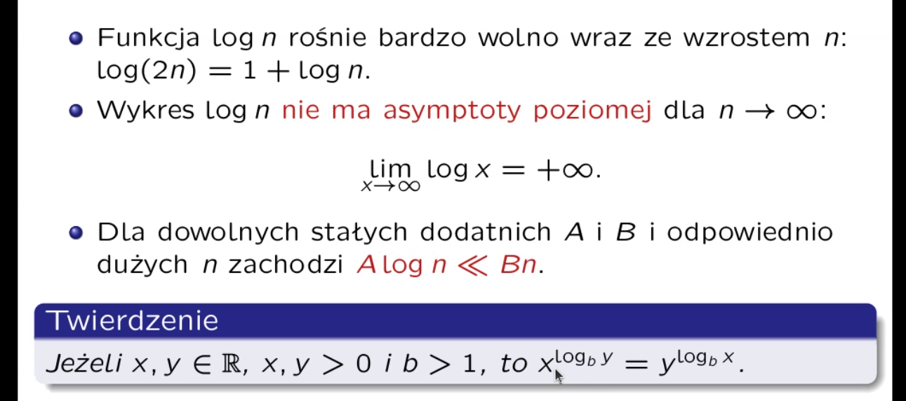

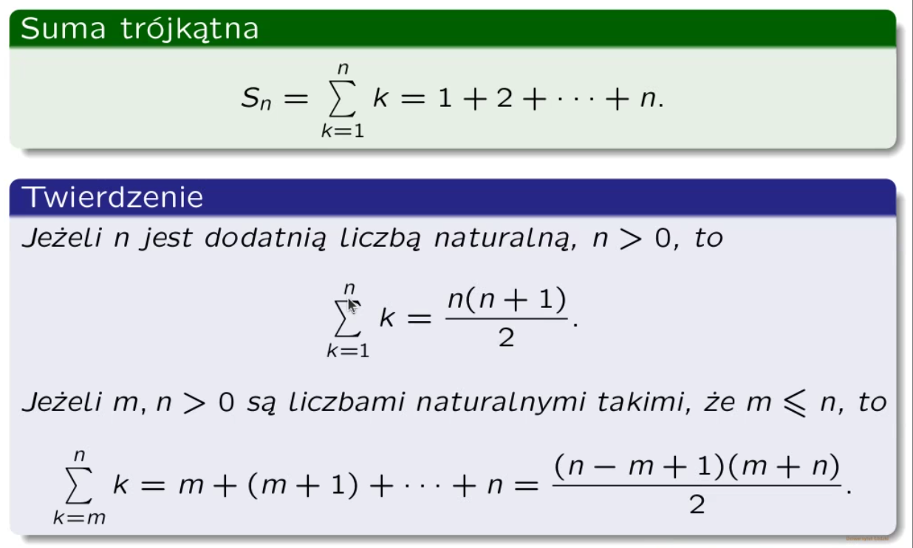
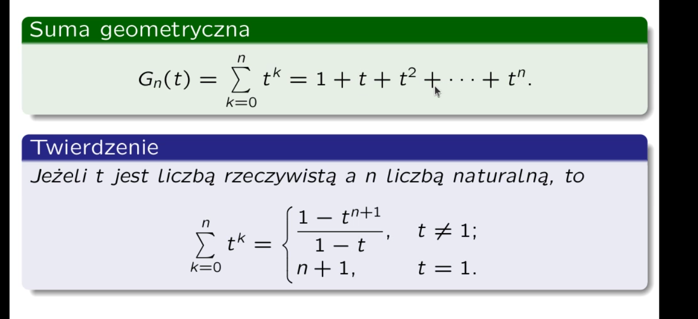

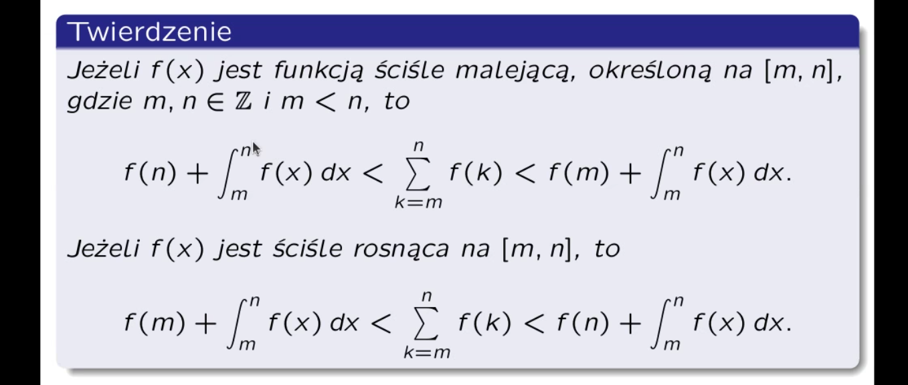

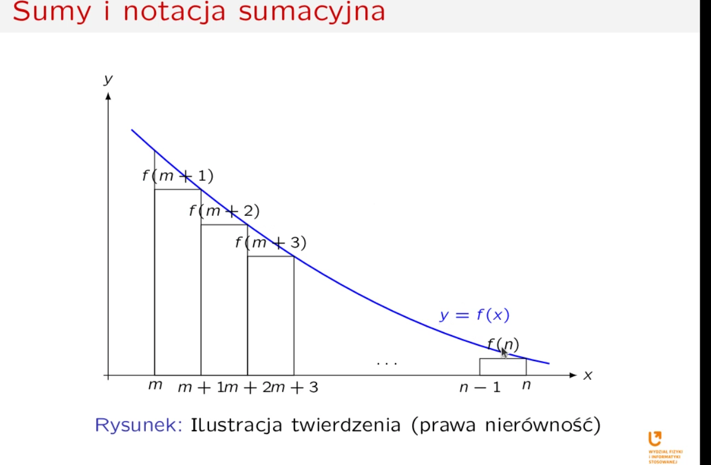
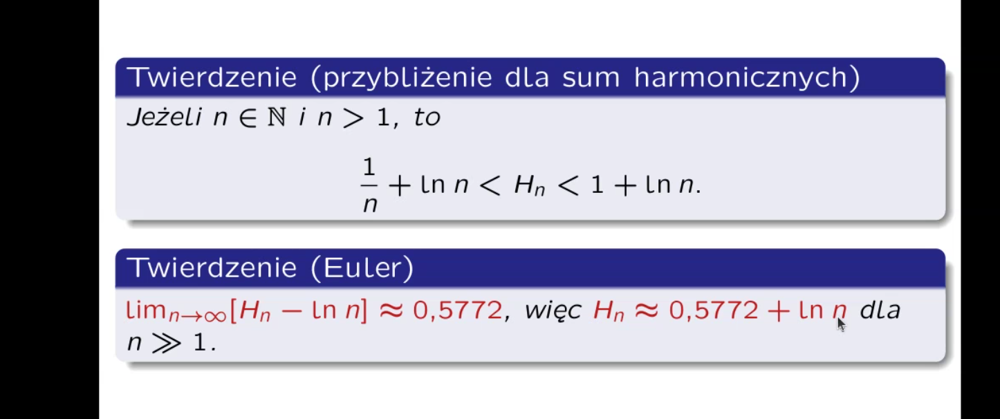

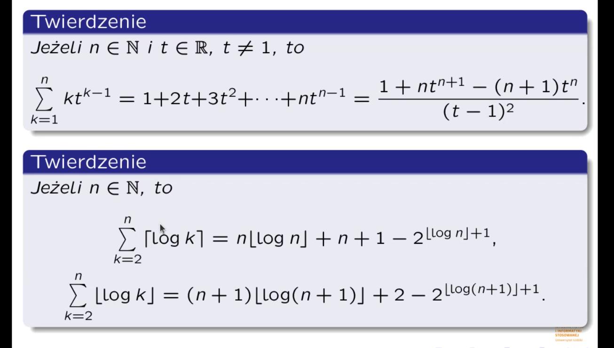

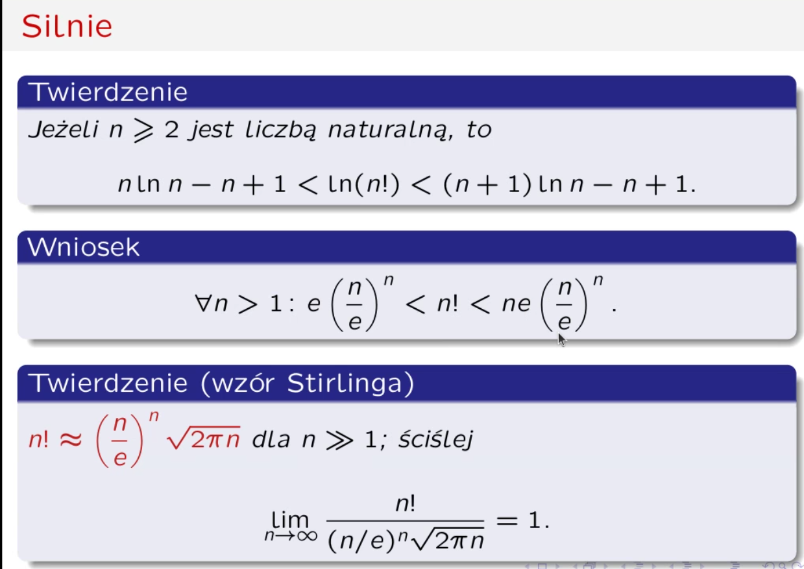
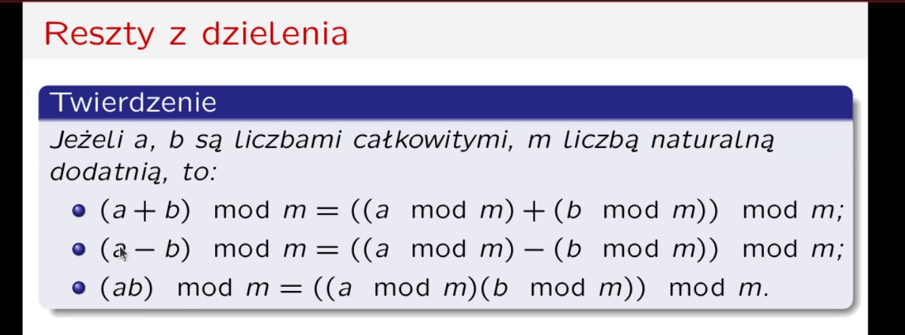

