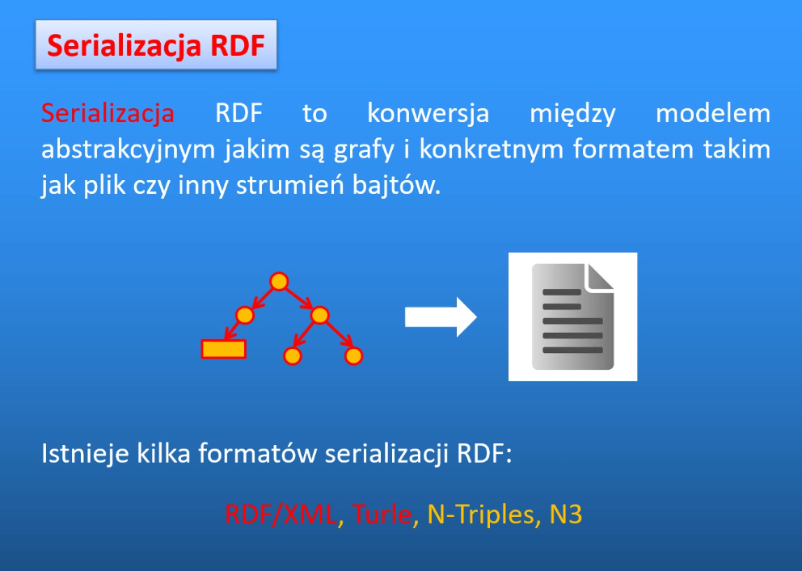

# Sieci semantyczne

## Problem: przetwarzanie informacji w języku naturalnym 

## Historia

xml pozwala na oddzielenie informacji od informacji o prezentacji

XML jest meta językiem bo można samemu zdefiniować znaczniki. Zbiór znaczników można nazwać językiem.

Wada: brak jednoznaczności w zapisie informacji. Można ją wymusić 

Maszyna nie wie, że wykładowca jest częścią kadry akademickiej. Maszyna nie ma wiedzy ogólnej wiedzy o świecie.
Do zapisu tego typu wiedzy służą ontologie. 

Internet semantyczny ma kategorie zasobów.
Typ połączenia ma znaczenie, to więcej niż tylko link. 

Trójka, stwierdzenie — najmilejsza porcja informacji 

Kolumny to fazy rozwoju internetu.

# (R)esource (D)escription (F)ramework

Podmiot-biały 
Orzeczenie-pomarańczowy 
Obiekt-czerwony 

